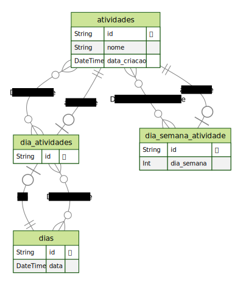

# Arquitetura da Solução

Pré-requisitos: <a href="3-Projeto de Interface.md"> Projeto de Interface</a>

Definição de como o software é estruturado em termos dos componentes que fazem parte da solução e do ambiente de hospedagem da aplicação.

## Diagrama de Classes

Diagrama de classes é uma representação estática utilizada na área da programação para descrever a estrutura de um sistema, apresentando suas classes, atributos, operações e as relações entre os objetos.

Este tipo de representação é bastante útil no desenvolvimento de sistemas e de softwares de computação, pois define todas as classes que o sistema precisa ter e serve de base para a construção de outros diagramas que definem o tipo de comunicação, sequência e estados dos sistemas.

O diagrama de classes é a parte central da Linguagem de Modelagem Unificada (UML – Unfied Modelling Language). Ele representa as principais finalidades da UML, tendo a função de separar os elementos de design da codificação do sistema.

## Modelo ER

O Modelo ER representa através de um diagrama como as entidades (coisas, objetos) se relacionam entre si na aplicação interativa.]

As referências abaixo irão auxiliá-lo na geração do artefato “Modelo ER”.

> - [Como fazer um diagrama entidade relacionamento | Lucidchart](https://www.lucidchart.com/pages/pt/como-fazer-um-diagrama-entidade-relacionamento)

## Esquema Relacional

O esquema Entidade-Relacionamento (ER) é uma representação gráfica que descreve a estrutura de um banco de dados e seus relacionamentos, sendo utilizado para ilustrar a forma como as entidades (como tabelas) se relacionam entre si, incluindo os atributos e chaves primárias de cada entidade. 

O esquema apresentado possui quatro tabelas, sendo que três delas (Atividade, Dia e DiaAtividade) estão relacionadas entre si. A tabela Atividade armazena informações sobre atividades, como o título e a data de criação. A tabela Dia é usada para representar dias específicos, contendo a data e uma lista de DiaAtividades relacionadas a esse dia. Já a tabela DiaAtividade é usada para relacionar atividades específicas com dias específicos, ou seja, ela é responsável por armazenar as informações sobre em quais dias específicos da semana aquela atividade deve ser rastreada.

Além disso, há a tabela DiaSemanaAtividade, que armazena informações sobre atividades que ocorrem em dias da semana específicos. Essa tabela tem um relacionamento com a tabela Atividade, indicando a atividade que ocorre em um determinado dia da semana.

Todos esses relacionamentos são definidos por meio de chaves estrangeiras, que são usadas para conectar as tabelas. No geral, o esquema ER apresenta uma estrutura bem definida, permitindo que sejam facilmente identificadas as relações entre as diferentes tabelas e como os dados estão organizados no banco de dados.

## Modelo Físico

A seguir apresenta-se um link para o arquivo banco.sql, contendo os scripts de criação das tabelas do banco de dados. Este arquivo está localizado na pasta src\bd e pode ser usado para criar a estrutura inicial do banco de dados. 

## Tecnologias Utilizadas

Descreva aqui qual(is) tecnologias você vai usar para resolver o seu problema, ou seja, implementar a sua solução. Liste todas as tecnologias envolvidas, linguagens a serem utilizadas, serviços web, frameworks, bibliotecas, IDEs de desenvolvimento, e ferramentas.

Apresente também uma figura explicando como as tecnologias estão relacionadas ou como uma interação do usuário com o sistema vai ser conduzida, por onde ela passa até retornar uma resposta ao usuário.

## Hospedagem

Explique como a hospedagem e o lançamento da plataforma foi feita.

> **Links Úteis**:
>
> - [Website com GitHub Pages](https://pages.github.com/)
> - [Programação colaborativa com Repl.it](https://repl.it/)
> - [Getting Started with Heroku](https://devcenter.heroku.com/start)
> - [Publicando Seu Site No Heroku](http://pythonclub.com.br/publicando-seu-hello-world-no-heroku.html)

## Qualidade de Software

Conceituar qualidade de fato é uma tarefa complexa, mas ela pode ser vista como um método gerencial que através de procedimentos disseminados por toda a organização, busca garantir um produto final que satisfaça às expectativas dos stakeholders.

No contexto de desenvolvimento de software, qualidade pode ser entendida como um conjunto de características a serem satisfeitas, de modo que o produto de software atenda às necessidades de seus usuários. Entretanto, tal nível de satisfação nem sempre é alcançado de forma espontânea, devendo ser continuamente construído. Assim, a qualidade do produto depende fortemente do seu respectivo processo de desenvolvimento.

A norma internacional ISO/IEC 25010, que é uma atualização da ISO/IEC 9126, define oito características e 30 subcaracterísticas de qualidade para produtos de software.
Com base nessas características e nas respectivas sub-características, identifique as sub-características que sua equipe utilizará como base para nortear o desenvolvimento do projeto de software considerando-se alguns aspectos simples de qualidade. Justifique as subcaracterísticas escolhidas pelo time e elenque as métricas que permitirão a equipe avaliar os objetos de interesse.

> **Links Úteis**:
>
> - [ISO/IEC 25010:2011 - Systems and software engineering — Systems and software Quality Requirements and Evaluation (SQuaRE) — System and software quality models](https://www.iso.org/standard/35733.html/)
> - [Análise sobre a ISO 9126 – NBR 13596](https://www.tiespecialistas.com.br/analise-sobre-iso-9126-nbr-13596/)
> - [Qualidade de Software - Engenharia de Software 29](https://www.devmedia.com.br/qualidade-de-software-engenharia-de-software-29/18209/)
